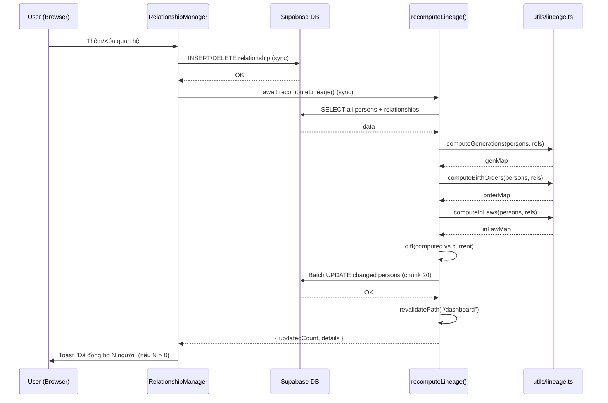

# Plan: Tự động tính đời khi cập nhật quan hệ cha con

**Ngày:** 2026-06-12  
**Approach:** Server Action — Full Recompute (from brainstorm)  
**Lane:** normal  
**Brainstorm:** `plans/2026-06-12-auto-recompute-lineage/brainstorm.md`

---

## Data Flow (Hot Path)



**Boundary notes:**
- Tất cả sync trong 1 HTTP request (Server Action)
- Không async/event-driven — đơn giản, dễ debug
- `revalidatePath` invalidate Next.js cache → lần fetch sau sẽ có data mới

---

## Assumptions

| # | Assumption | If False → Impact | Mitigation |
|---|-----------|-------------------|------------|
| A1 | Tree < 1000 persons | Fetch + compute chậm (>2s). UX xấu. | Monitor duration. Nếu >1s thường xuyên → optimize incremental cascade. |
| A2 | 1 editor tại 1 thời điểm | Race condition: 2 recompute đồng thời → batch updates xen kẽ. | Acceptable. Per-row atomic. Nếu cần → thêm mutex/queue. |
| A3 | Supabase connection pool đủ cho fetch + batch | Connection exhaustion → timeout. | Chunk 20 + Promise.all (không flood). Monitor connection usage. |
| A4 | Data tạm thời inconsistent OK trong ~500ms | Giữa mutation và recompute, generation có thể sai. | Acceptable cho family tree. Không real-time display. |
| A5 | User OK với auto-toast, không cần confirm | User bị surprise khi thấy generation thay đổi. | Toast rõ ràng, auto-dismiss 4s. Silent nếu N=0. |
| A6 | Supabase Auth session valid khi gọi server action | 401/403 → recompute fail silently. | Server action check auth, return error. Toast error message. |

---

## Approach

Server Action `recomputeLineage()` — sau mỗi relationship mutation (thêm/xóa/thay đổi), tự động fetch toàn bộ persons + relationships, chạy 3 compute functions (generation/birth_order/is_in_law), diff và batch update những người thay đổi.

Extract 3 algorithm functions từ `LineageManager.tsx` → `utils/lineage.ts` (shared utility) để cả Server Action và LineageManager đều reuse.

---

## File Mapping

| File | Action | Mô tả |
|------|--------|-------|
| `utils/lineage.ts` | **TẠO MỚI** | 3 pure functions: computeGenerations, computeBirthOrders, computeInLaws |
| `app/actions/lineage.ts` | **TẠO MỚI** | Server action: recomputeLineage() — fetch all, compute, diff, batch update |
| `components/RelationshipManager.tsx` | **SỬA** | Gọi recomputeLineage() sau 4 mutations; xóa auto-update đơn giản cũ |
| `components/LineageManager.tsx` | **SỬA** | Xóa 3 hàm inline, import từ utils/lineage.ts |
| `vitest.config.ts` | **TẠO MỚI** | Config vitest (nếu chưa có) |
| `utils/__tests__/lineage.test.ts` | **TẠO MỚI** | Unit tests cho 3 compute functions |

**Tổng:** 4 file tạo mới, 2 file sửa.

---

## Test Plan

### Test Strategy
- **Test type:** Unit (pure functions)
- **Coverage target:** 90%+ cho 3 compute functions (logic quan trọng, edge cases nhiều)
- **Test runner:** vitest (cần cài đặt mới)

### Test Cases

#### computeGenerations
| # | Scenario | Expected | Priority |
|---|----------|----------|----------|
| 1 | Tree đơn giản: Root → Child → Grandchild | Root=1, Child=2, Grandchild=3 | P0 |
| 2 | Marriage: spouse cùng generation | Both = same gen | P0 |
| 3 | Multiple roots (disconnected families) | Each root = 1 | P0 |
| 4 | Person không reachable (orphan) | gen = không có trong map | P1 |
| 5 | Spouse of root có parents elsewhere | Spouse gen = spouse's own root gen | P1 |
| 6 | Cycle detection (A→B→C→A) | Không infinite loop | P1 |

#### computeBirthOrders
| # | Scenario | Expected | Priority |
|---|----------|----------|----------|
| 1 | 3 children cùng cha, sorted by birth_year | Order 1,2,3 | P0 |
| 2 | Children không có birth_year | Sort by name (Vietnamese) | P1 |
| 3 | In-law children skipped | Không count trong order | P0 |
| 4 | Two parents share children | Child gets max order from either parent | P1 |

#### computeInLaws
| # | Scenario | Expected | Priority |
|---|----------|----------|----------|
| 1 | Person có parents trong tree | is_in_law = false | P0 |
| 2 | Person không parents, có spouse (spouse có parents) | is_in_law = true | P0 |
| 3 | Root person (no parents, no spouse) | is_in_law = false | P0 |
| 4 | Two roots married, neither has parents | Male = bloodline, female = in-law (fallback) | P1 |

### Mock Dependencies
- Không cần mock — 3 functions là pure, chỉ nhận input và trả về Map

### Test Data
- Inline fixtures trong test file (persons + relationships arrays)

### Prerequisites
- Cài vitest: `npm install -D vitest`
- Tạo `vitest.config.ts`

### Server Action — Manual Test Script

Server action `recomputeLineage()` không dễ unit test (cần mock Supabase). Dùng manual test script:

| # | Scenario | Steps | Expected |
|---|----------|-------|----------|
| SA1 | Auth check | Gọi từ non-admin session | Return `{ success: false, error: "..." }` |
| SA2 | Empty tree | DB có 0 persons | Return `{ success: true, updatedCount: 0 }` |
| SA3 | Already consistent | Tree đúng generation | Return `{ success: true, updatedCount: 0 }` |
| SA4 | Needs update | Person generation=null, có cha gen=2 | Return updatedCount > 0, person gen=3 |
| SA5 | Partial failure | Simulate network error mid-batch | Return partialError, some persons updated |
| SA6 | Re-run idempotent | Gọi 2 lần liên tiếp | Lần 2: updatedCount=0 |
| SA7 | Disconnected person | Person không có relationship | generation=null, không crash |

**Cách test:** Tạm thời tạo test API route `app/api/test-recompute/route.ts` (chỉ dev mode). Gọi từ browser console. Xóa sau khi verify.

---

## Phases

### Phase 1: Extract Utility + Tests ✅ Done (2026-06-12)

**Files:** `utils/lineage.ts`, `utils/__tests__/lineage.test.ts`, `vitest.config.ts`

**Steps:**
1. Cài vitest: `npm install -D vitest`
2. Tạo `vitest.config.ts`
3. Viết unit tests cho 3 compute functions (tests red)
4. Copy 3 hàm từ `components/LineageManager.tsx` → `utils/lineage.ts` (export)
5. Refactor type signatures: nhận minimal Pick<> types thay vì full Person/Relationship
6. Chạy tests → verify green
7. Refactor `LineageManager.tsx`: xóa 3 hàm inline, import từ `utils/lineage.ts`
8. Verify LineageManager vẫn hoạt động (check build)

**Verify:**
- `npx vitest run` — all tests pass
- `npm run build` — no type errors
- LineageManager component vẫn render đúng

---

### Phase 2: Server Action recomputeLineage ✅ Done (2026-06-12)

**Files:** `app/actions/lineage.ts`

**Steps:**
1. Tạo `app/actions/lineage.ts` với `"use server"` directive
2. Implement `recomputeLineage()`:
   - Auth check: `getProfile()` → admin/editor only. Fail fast nếu không có quyền.
   - Fetch all persons: `supabase.from("persons").select("id, full_name, generation, birth_order, is_in_law, gender, birth_year")`
   - Fetch all relationships: `supabase.from("relationships").select("type, person_a, person_b")`
   - Gọi 3 compute functions từ `utils/lineage.ts`
   - Diff: so sánh computed values với current DB values
   - Batch UPDATE (chunk 20, Promise.all) cho changed persons
   - `revalidatePath("/dashboard")`
   - Return `{ updatedCount, details }`
3. Error handling: wrap trong try/catch, return `{ error }` on failure
4. Verify build: `npm run build`

**Return type:**
```typescript
{
  success: true,
  updatedCount: number,
  details: Array<{
    id: string;
    full_name: string;
    generation: { old: number | null; new: number | null };
    birth_order: { old: number | null; new: number | null };
    is_in_law: { old: boolean; new: boolean };
  }>
}
// OR
{
  success: false,
  error: string
}
```

**Partial Failure Strategy:**
- Nếu batch update fail ở chunk N (ví dụ chunk 2/3), chunks trước đã commit → data partially updated.
- **Decision: Accept partial update** (Option B). Lý do:
  - Family tree không phải critical system. Partial update vẫn tốt hơn không update.
  - User có thể re-run từ LineageManager page nếu cần.
  - Rollback phức tạp hơn value nó mang lại.
- **Implementation:** Trong loop, nếu 1 chunk fail → log error, continue chunks còn lại. Return `{ success: true, updatedCount: N, partialError: "Failed to update X persons" }`.
- Caller (toast) hiển thị: "Đã đồng bộ N người (có lỗi với X người)" nếu partialError.

**Idempotency:**
- Nếu `triggerRecompute()` gọi 2 lần liên tiếp (double-click, concurrent mutations):
  - Lần 1: compute → diff → update → updatedCount = K
  - Lần 2: compute → diff = 0 (vì lần 1 đã fix) → updatedCount = 0 → no DB writes
- **Safe.** Không cần lock/mutex. Toast sẽ không hiện lần 2 (vì updatedCount=0).

**Verify:**
- `npm run build` — no errors
- Manual test: gọi server action từ console hoặc tạm thời expose qua API route

---

### Phase 3: Integrate + UX ✅ Done (2026-06-12)

**Files:** `components/RelationshipManager.tsx`

**Steps:**
1. Import `recomputeLineage` từ `app/actions/lineage.ts`
2. Thêm state cho toast notification: `const [recomputeToast, setRecomputeToast] = useState<string | null>(null)`
3. Thêm helper function:
   ```typescript
   const triggerRecompute = async () => {
     const result = await recomputeLineage();
     if (result.success && result.updatedCount > 0) {
       setRecomputeToast(`Đã đồng bộ thế hệ cho ${result.updatedCount} người`);
       setTimeout(() => setRecomputeToast(null), 4000);
     }
   };
   ```
4. **handleAddRelationship** (line ~318):
   - Xóa block auto-update đơn giản (lines 360-398)
   - Sau `fetchRelationships()`, thêm `await triggerRecompute()`
5. **handleBulkAdd** (line ~415):
   - Sau success path, thêm `await triggerRecompute()`
6. **handleQuickAddSpouse** (line ~522):
   - Sau success path, thêm `await triggerRecompute()`
7. **handleDelete** (line ~598):
   - Sau `fetchRelationships()`, thêm `await triggerRecompute()`
8. Thêm toast UI component (nhẹ, không block, auto-dismiss sau 4s)

**Verify:**
- `npm run build` — no errors
- Manual E2E: thêm con → check generation. Xóa quan hệ → check recompute. Bulk add → check all generations.
- LineageManager page vẫn hoạt động độc lập

---

### Phase 4: Verification & Cleanup ✅ Done (2026-06-12)

**Steps:**
1. Chạy full test suite: `npx vitest run`
2. Build check: `npm run build`
3. Manual test scenarios (từ brainstorm §8):
   - [ ] Thêm con → generation cascade
   - [ ] Xóa cha → recompute subtree
   - [ ] Bulk add children → correct generations
   - [ ] Thêm vợ/chồng → is_in_law correct
   - [ ] LineageManager manual vẫn hoạt động
   - [ ] Không regression CRUD relationships
4. Review code: no dead code, consistent patterns
5. Commit: `feat(lineage): auto-recompute generation on relationship change`

---

## Risks & Mitigations

| Risk | Impact | Mitigation |
|------|--------|------------|
| Performance tree lớn (>1000 persons) | Medium | Monitor duration. Optimize sau bằng incremental. |
| Race condition (concurrent editors) | Low | Acceptable. Per-row atomic updates. |
| Toast UX gây distraction | Low | Auto-dismiss 4s. Silent nếu updatedCount=0. |
| Vitest setup conflicts with Next.js | Low | Use `vitest` with `jsdom` environment. |

---

## Dependencies

- `vitest` (devDependency) — cho unit tests
- Không có dependency mới cho runtime

---

## Success Criteria

1. ✅ Thêm/xóa quan hệ cha con → generation tự động cập nhật cho toàn bộ affected persons
2. ✅ birth_order tự động tính lại khi thêm/xóa con
3. ✅ is_in_law tự động cập nhật khi thêm/xóa marriage
4. ✅ LineageManager vẫn hoạt động (dùng shared utility)
5. ✅ Toast notification khi có thay đổi
6. ✅ Unit tests pass cho 3 compute functions
7. ✅ No regression — toàn bộ CRUD relationships hoạt động bình thường

_Shipped: 2026-06-12 — all phases complete._
