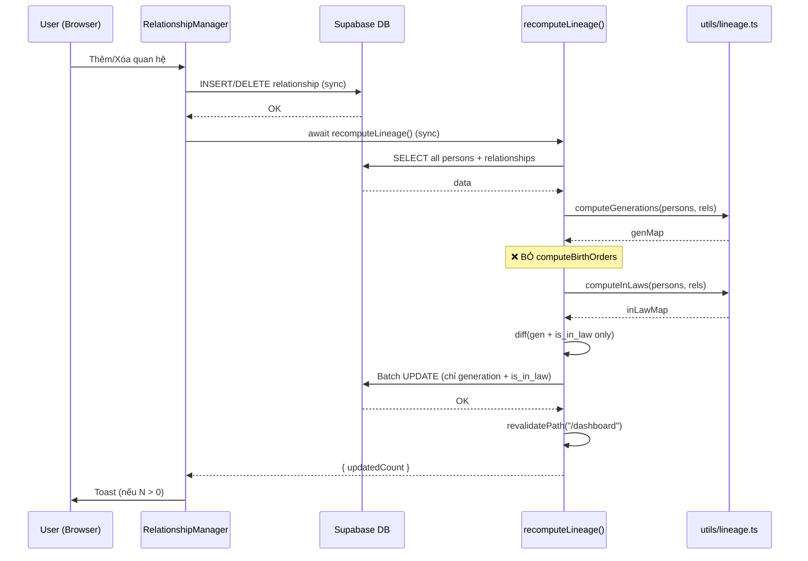

# Plan: Fix Birth Order Jumping — Bỏ auto-compute birth_order

**Ngày:** 2026-06-13
**Approach:** Bỏ auto-compute birth_order khỏi recompute flow (from brainstorm)
**Lane:** normal
**Brainstorm:** `plans/2026-06-13-birth-order-bug/brainstorm.md`

---

## Approach

Bỏ `computeBirthOrders` khỏi `recomputeLineage()` flow. Chỉ giữ auto-compute `generation` + `is_in_law`. User tự đánh birth_order thủ công.

**Lý do:** `computeBirthOrders` gây cascade bug — khi `is_in_law` thay đổi → birth_order của anh chị em nhảy loạn. User muốn kiểm soát thứ tự con trưởng/thứ.

---

## Data Flow (Sau Fix)

**Thay đổi vs cũ:** Bỏ bước `computeBirthOrders`, bỏ field `birth_order` trong diff + batch update.

---

## Test Plan

### Test Strategy
- **Test type**: Unit tests
- **Coverage target**: 100% cho changed code paths
- **Test runner**: vitest

### Test Cases

| # | Target | Scenario | Expected | Priority |
|---|--------|----------|----------|----------|
| 1 | `recomputeLineage()` | Thêm relationship → recompute | `birth_order` của TẤT CẢ persons KHÔNG thay đổi | P0 |
| 2 | `recomputeLineage()` | Xóa relationship → recompute | `birth_order` của TẤT CẢ persons KHÔNG thay đổi | P0 |
| 3 | `recomputeLineage()` | is_in_law thay đổi → recompute | `birth_order` KHÔNG cascade thay đổi | P0 |
| 4 | `computeBirthOrders()` | Hàm vẫn tồn tại và hoạt động độc lập | Vẫn export + chạy đúng khi gọi trực tiếp | P1 |

### Mock Dependencies
- Mock Supabase client: `vi.mock('@/utils/supabase/queries')`
- Mock `revalidatePath`: `vi.mock('next/cache')`

### Test Data
- Dùng test fixtures từ `utils/__tests__/lineage.test.ts` hiện có
- Thêm fixture cho regression test: family với birth_order đã set, verify không thay đổi

### Prerequisites
- Không cần thay đổi conftest
- Không cần test utils mới

---

## File Mapping

| File | Action | Mô tả |
|------|--------|-------|
| `utils/__tests__/lineage.test.ts` | **SỬA** | Thêm regression tests: verify birth_order KHÔNG bị thay đổi |
| `app/actions/lineage.ts` | **SỬA** | Bỏ computeBirthOrders khỏi flow, bỏ birth_order khỏi diff + update |
| `utils/lineage.ts` | **KHÔNG ĐỔI** | Giữ nguyên computeBirthOrders (có thể dùng trong tương lai) |

**Tổng:** 2 file sửa, 0 file tạo mới.

---

## Assumptions

| # | Assumption | If False → Impact | Mitigation |
|---|-----------|-------------------|------------|
| A1 | User OK với manual birth_order | User phải tự đánh thứ tự cho từng người | LineageManager vẫn có nút "Tính toán" nếu muốn auto |
| A2 | computeBirthOrders không bị gọi từ nơi khác | Nếu có nơi khác gọi → vẫn hoạt động bình thường | Grep verify: chỉ recomputeLineage gọi |
| A3 | Existing data không cần migration | birth_order cũ (có thể sai) giữ nguyên | User manual fix từ LineageManager hoặc UI |

---

## Rollout

- **Bước 1:** Deploy code change (bỏ auto birth_order)
- **Bước 2:** User verify: thêm/xóa quan hệ → birth_order không nhảy
- **Bước 3:** User manual fix birth_order nếu cần (từ LineageManager hoặc UI)

Không cần data migration script. Không cần feature flag.

---

## Phases

1. `phase-01-test-regression.md` — Viết regression tests (RED) ✅ Done (2026-06-13)
2. `phase-01-test-review.md` — User review tests ✅ Done (2026-06-13)
3. `phase-02-impl-fix.md` — Implement fix (GREEN) ✅ Done (2026-06-13)

_Shipped: 2026-06-13 — all phases complete._
